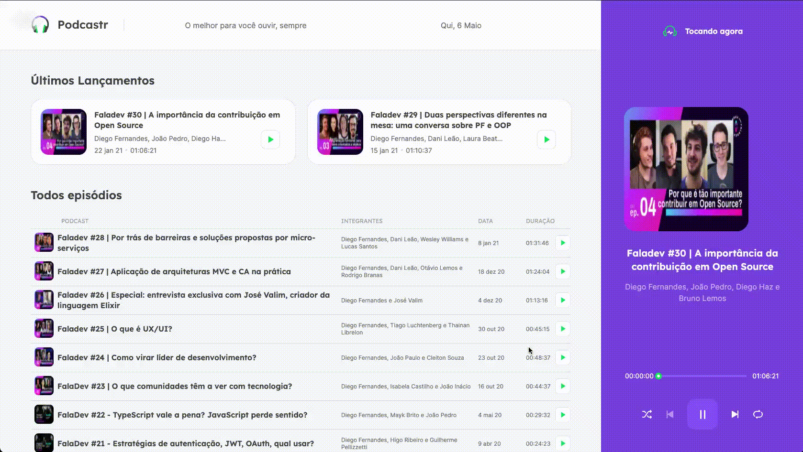

Projeto Podcastr foi desenvolvido durante imersão de React JS na NLW da Rocketseat. NLW é um evento online com muito código, desafios, networking e um único objetivo: ir para o próximo nível.  

 
 

 

 

 

 

### Prática
---
Programação é um universo infinito, por isso ter foco é o primeiro passo.

  

### Tecnologias
---
* [Next](https://nextjs.org/docs)
* [React](https://pt-br.reactjs.org/)
* [Typescript](https://www.typescriptlang.org/)
* [Sass](https://sass-lang.com/)
* [Json Server](https://github.com/typicode/json-server)
* [Axios](https://github.com/axios/axios)
* [Context](https://pt-br.reactjs.org/docs/context.html)

  

## Instalação
---

Este projeto utiliza o [Next](https://nextjs.org/docs).

git clone: https://github.com/indiamarasiqueira/podcastrnext-NLW.git

Depois acesse o diretório e instale as dependências executando o seguinte comando:

$ yarn install # ou npm install

Agora basta abrir o projeto rodando:
 

yarn start # ou npm start

 

## Como contribuir
---

- Fork esse repositório;
- Crie uma branch com a sua feature: `git checkout -b my-feature`
- Commit suas mudanças: `git commit -m 'feat: My new feature'`
- Push a sua branch: `git push origin my-feature`

Depois que o merge da sua pull request for feito, você pode deletar a sua branch.

 

## Licença
---
Esse projeto está sob a licença MIT. Veja o arquivo [LICENSE](LICENSE) para mais detalhes.

 

## 🤝 Créditos
---
### [Rocketseat](https://rocketseat.com.br/)
#### A primeira coisa que você precisa saber sobre a jornada como dev é que o aprendizado é contínuo e sempre haverá um próximo nível

---
 

Desenvolvido com ❤️ por Indiamara Tibes Siqueira

